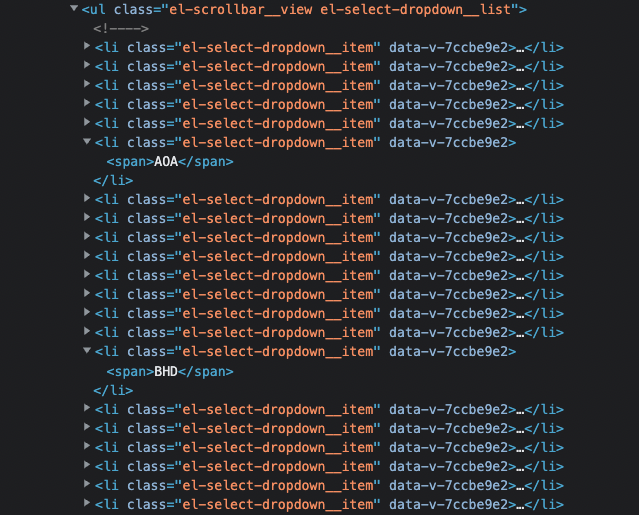
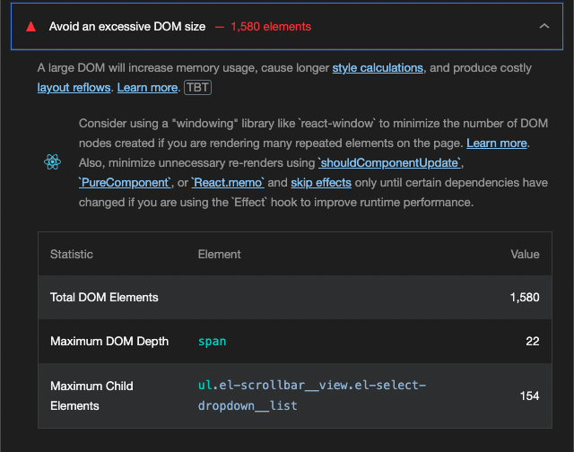
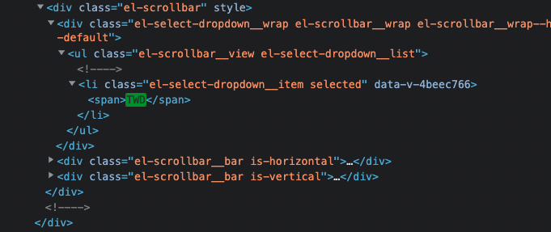
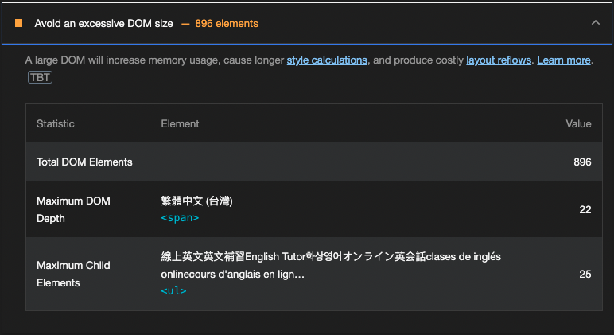

Photo by [Sai Kiran Anagani
](https://unsplash.com/@anagani_saikiran) on [Unsplash](https://unsplash.com/photos/5Ntkpxqt54Y)

隨著前端逐漸開始重視使用者體驗，網頁的效能也越來越受到強調，也有越來越多的人在討論最網頁載入效能優化（Web Performance Optimization）。而大部分都會圍繞在透過減少 bundle size，來減少載入時間。而整個網頁，從使用者進入到渲染出整個頁面，其實其中有很多步驟都是會影響網頁效能，像今天要提到的 DOM 過大（Excessive DOM size）就是其中一項。

 

## **為何會 DOM 過大**
這次在優化我們 Google Lighthouse 的分數時發現，由於我們支援多國語系以及多國幣別，因此需要在 `<ul>` element 下包很多 `<li>` element 來組成清單，而當需要顯示很多資料加上這種多層的結構，就導致我們出現 Excessive DOM size 的錯誤，如下圖。其他常見可能導致出現 Excessive DOM size 錯誤的還包括大型顯示資料的 `<table>` 結構。

 

## **Lighthouse DOM 大小檢測**
根據目前 [web.dev](https://web.dev/i18n/en/dom-size/) 的資料，Google Lighthouse 的 DOM 大小標準為：

- body 元素少於 800 個 node 為 success
- body 元素超過 800 個 node 為 warning
- body 元素超過 1400 個 node 為 error

可以看到 Lighthouse 檢測出來的結果，DOM size 達到 1600，並且影響最大的 DOM 就是幣別的選單。

 

## **DOM 過大的影響**
### 網路資源及加載效能：
過大的 DOM tree 通常會導致html file 跟著變大，導致需要下載的資源及時間增加，以及消耗更多的加載效能。

### 畫面渲染效能：
太大的 DOM 在渲染到畫面上的位置及樣式時，也會需要更多的計算，從而導致渲染效能下降。

### 記憶體消耗：
當我們想透過 Javascript 與 DOM 上的節點進行互動時，越多的 DOM 會需要使用到越多的記憶體，可能導致使用者的 UX 下降。

 

## 優化方法
### lazy loading (延遲載入)

如果是一開始不需要被使用者看見的 DOM，此時如果我們還去加載的話，就會導致效能的浪費。因此可以透過找出使用者在看到相關的 DOM 之前需要的行為，在使用者作出對應的行為我們再去延遲載入元件，來優化效能。

### Virtual DOM (虛擬DOM)

[**Virtual DOM**](https://zh-hant.reactjs.org/docs/faq-internals.html) 是透過物件來模擬 DOM 產生的樹狀結構。優點是透過操作這些 Virtual DOM 物件之後，再將這些改動更新到真實的 DOM 上，以期提升效能。因此目前也有一些第三方套件是透過這樣的概念，來解決過大的 DOM 顯示畫面上造成的效能問題，例如 React 生態的 [**react-virtual**](https://www.npmjs.com/package/react-virtual) 以及 Vue 生態的 [**vue-virtual-scroller**](https://www.npmjs.com/package/vue-virtual-scroller)。

### 簡化 CSS Selector

當我們無法避免巨大的 DOM，又會透過 Javascript 來對 DOM 進行操作時，我們應該避免使用會選取大量 DOM 的 css selector  來操作，否則會消耗大量的記憶體。可以透過降低 css selector 的複雜性的方法，例如 BEM，優化效能。

 

## 結果
在我們專案中，使用者登入之後會看到自己選擇的國家以及幣別，因此經過考量後決定使用 lazy loading 的方式。在使用者一開始進入頁面時畫面上只保留一個項目顯示在畫面上，當使用者想要切換到別的國家或是幣別，我們才透過在 `select` element 上的 `foucs` 事件來執行 callback function，載入其他的清單選項。可以看到調整後我們成功將一開始的 DOM size 減少 40% 以上。

 

## 總結

1. 除了常見的 bundle size，還有很多其他因素會影響我們網頁的效能。
2. 過大的 DOM 除了會使網頁的載入速度變慢，同時也可能會影響使用者體驗。
3. 針對 DOM 過大而產生的效能問題，有多種解決方法，可以選擇自己最合適的項目。

最後，如果文章中有任何問題或是錯誤的部分，可以透過 [LinkedIn](https://www.linkedin.com/in/yu-hsiang-wang/) 私訊告訴我，我會盡快回覆及修正，非常感謝！

### Refs:

- [https://web.dev/i18n/en/dom-size/](https://web.dev/i18n/en/dom-size/)
- [https://www.corewebvitals.io/pagespeed/fix-avoid-excessive-dom-size-lighthouse](https://www.corewebvitals.io/pagespeed/fix-avoid-excessive-dom-size-lighthouse)
- [https://zh-hant.reactjs.org/docs/faq-internals.html](https://zh-hant.reactjs.org/docs/faq-internals.html)