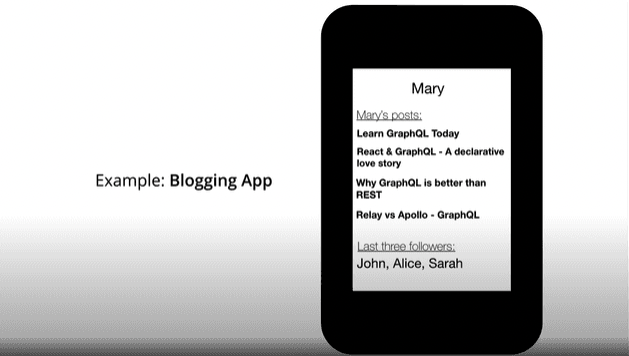
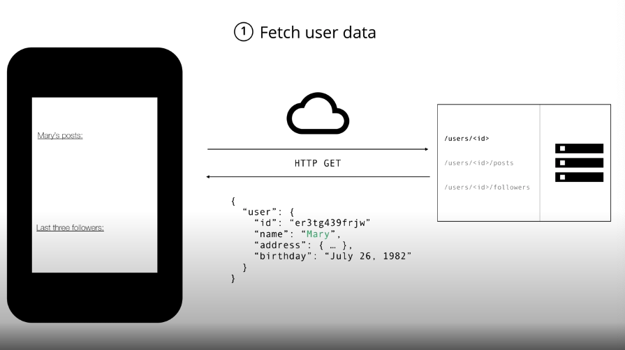
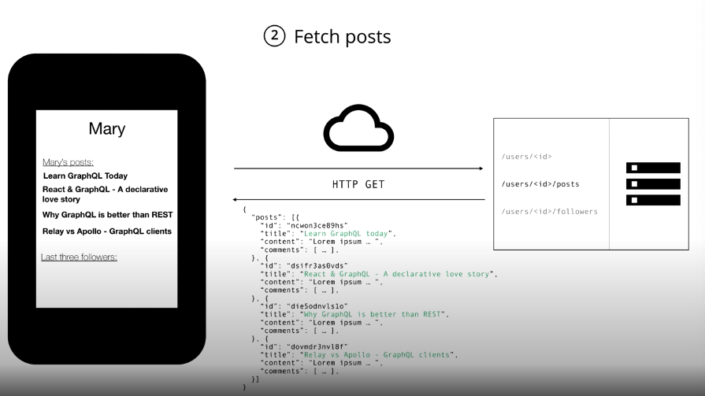
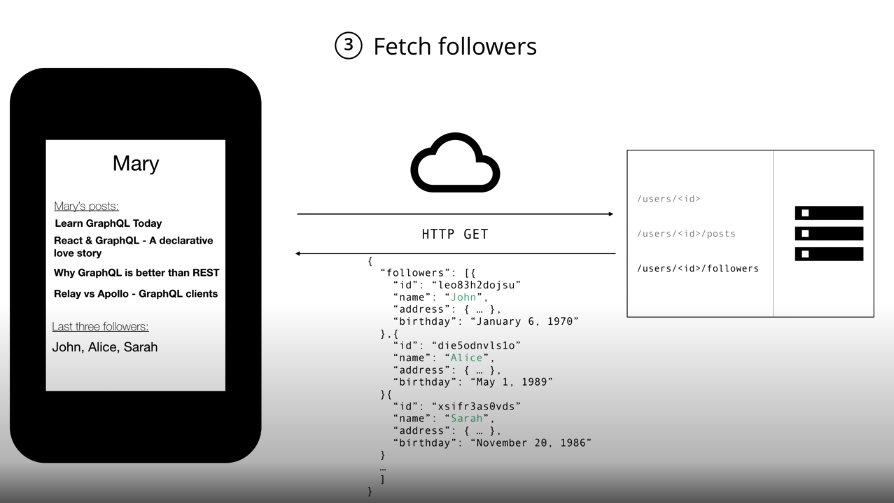
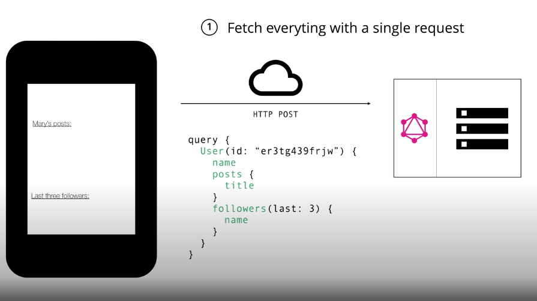
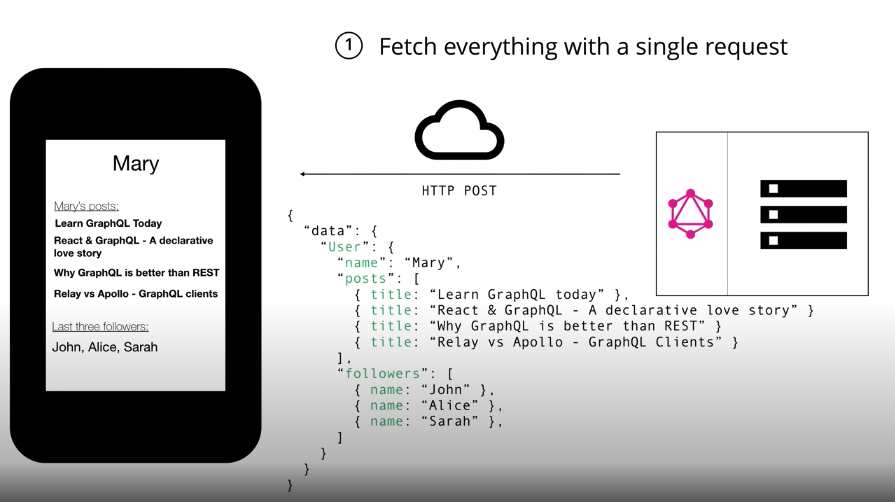

Photo by [Jason Coudriet
](https://unsplash.com/@jcoudriet) on [Unsplash](https://unsplash.com/photos/eQux_nmDew0)

[GraphQL](https://graphql.org/) 是一套開源的 API 標準，最早是由 Facebook 內部在 2012 年開始開發，直到 2015 年才公開發布。與 RESTful API 比起來，GraphQL 透過由 client 端所定義的資料結構，再由 server 端返回相同資料結構的對應資料，來避免 server 端回傳多餘資料，加快 client 端獲取資料的速度，因此以高彈性以及高效能所著名。最近終於有機會使用到 GraphQL，也藉此機會來重新好好認識 GraphQL。

## 什麼是 GraphQL？

GraphQL 是一種 API 的查詢語言，也是一套新的 API 標準。核心為透過 client 端宣告不同的資料結構與 server 端溝通來獲取所需要的資料，此外 GraphQL 只需要一個 endpoint 搭配上不同的 query，就能執行所有的 CRUD，因此與 RESTful API 比起來，具有更高的效能以及彈性。

## 更有效率的 GraphQL

直到現在，RESTful API 還是大部分網頁開發的主流， 但隨著這些年來攜帶式裝置的進步，以及各種前端框架的突破，我們對於 API 的設計會更著重於這些面向：

### 手機版網頁
隨著手機的使用率提高，網頁在手機上被打開的次數也越來越多，此時我們不得不去考慮如降低使用電力以及傳輸資料的大小。透過 GraphQL，我們可以避免數據冗餘（overfetching）和請求冗餘（underfetching)，同時降低使用者在網頁上消耗的電力。
    
### 快速開發及更新  
持續開發以及產品快速迭代，是目前每間公司都無法避免的情況。當前端需要新的顯示資料，在 RESTful 設計下最常遇到的問題，就是要在原本的 API 開一個欄位，或是需要一支全新的 API 來幫助我們拿到需要的資料。但是透過 GraphQL，我們可以直接由前端修改需要的資料結構，這樣不僅能減少開發時程，也大幅增加產品迭代時的彈性。
    

## 實際舉例

以下將透過一個簡單的的部落格網站例子，可以讓我們理解 RESTful 可能會遇到的問題，以及 GraphQL 如何來解決，讓我們理解 GraphQL 強大的地方。

可以看到在下圖的範例中，我們需要將使用者的所有文章的標題，以及最新的三個追蹤者的名稱顯示在畫面上。

### 使用 RESTful API
當如果是使用 RESTful API，client 端會需要發送三個不同的請求給後端，來獲取我們所需的全部資料。

1. `/users/:id` : 首先，我們需要顯示使用者的名稱，因此我們會需要ㄧ隻 API，來幫助我們取得使用者的相關資料。

2. `/users/:id/posts` : 在取得使用者名稱之後，我們需要拿到所有文章標題，用來顯示在畫面上。因此我們需要第二隻 API 來取得需要的文章資料。

3. `/users/:id/followers` : 最後，為了顯示追隨者的名稱，我們需要透過第三隻 API 來取得追隨者的資料。

    
### 使用 GraphQL
若是使用 GraphQL，在使用者登入之後，我們只需要透過 user id 以及定義好的資料結構，就能透過一筆請求，就從 server 端拿到我們所需的文章標題，以及追隨者名稱的資料，而且不會回傳多餘的資料給 client 端。
    

1. 定義所需欄位的資料結構
    
    

1. 透過發送所需的資料結構，拿到所有對應的欄位資料
    
    
## GraphQL  優勢
    
### 避免數據冗餘和請求冗餘
如同上面 RESTful API 的例子所示。當回傳的請求內包含額外的資料，此種狀況會導致資料傳輸效能的浪費，就是所謂的數據冗餘(overfetching)。
另外當 client 端無法透過一次請求取得所有我們需要的資料，需要透過額外的請求，才能滿足 client 端的需求，這種情況就是請求冗餘(underfetching or n+1-requests problem)。
### 提升產品快速迭代的開發效率
一般 RESTful API 的結構與路徑，通常與 client 端的 view 相關，也因此 view 更動時，API 結構或是路徑可能就會需要一起更動，造成開發上的延遲。但是透過 GraphQL，client 端只需要更改請求的資料結構，就能滿足 view 上的變動，不僅提供了開發時的彈性，也提高了網頁開發的效率。
    
## 總結    
雖然 RESTful API 能滿足很多 website application 的需求，但隨著攜帶式裝置的普及，以及網頁開發的快速迭代，GraphQL  可以幫助我們解決更多 RESTful API 的瓶頸。在之後的文章中也會繼續介紹 GraphQL 的用法，希望大家有機會都可以試試 GraphQL 帶來的高彈性與快速開發的好處。
    
最後，如果文章中有任何問題或是錯誤的部分，可以透過 [LinkedIn](https://www.linkedin.com/in/yu-hsiang-wang/) 私訊告訴我，我會盡快回覆及修正，非常感謝！
    
### Refs:
  * [https://graphql.org/](https://graphql.org/)
  * [https://en.wikipedia.org/wiki/GraphQL](https://en.wikipedia.org/wiki/GraphQL)
  * [https://www.howtographql.com/](https://www.howtographql.com/)